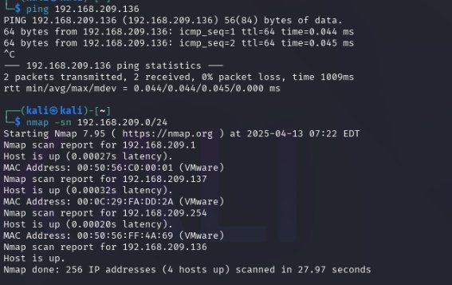
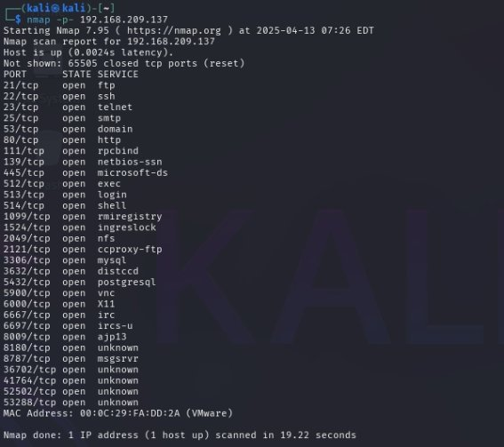

**Introducción** 

En este laboratorio de pentesting se realizó una evaluación de seguridad sobre una máquina vulnerable (Metasploitable 2)  con el objetivo de encontrar fallas explotables y obtener acceso remoto no autorizado desde una maquina a otra. 

La evaluación se llevó a cabo en un entorno controlado utilizando herramientas como “nmap”,  “Metasploit Framework”  y maquinas virtuales en “Vmware”. 

El objetivo es demostrar algunas habilidades prácticas en pruebas de penetración, explotación de vulnerabilidades y análisis post-explotación, documentando los resultados. 

**Metodología** 

1. **Enumeración de servicios**: 

   Se utilizó Nmap para escanear los puertos abiertos y detectar los servicios activos en la máquina víctima (Metasploitable 2).  > nmap –sV –sC –p 21 192.168.209.137 

2. **Análisis de servicios identificados**: 

   Se detectó un servidor FTP corriendo vsFTPd 2.3.4, una versión conocida por contener una backdoor. 

3. **Explotación con Metasploit**: 

   Se utilizó el módulo exploit/unix/ftp/vsftpd\_234\_backdoor del framework Metasploit. Luego de configurar la IP de la víctima, se ejecutó el exploit y se obtuvo una shell remota como usuario root. 

4. **Acceso al sistema**: 

   A través de la sesión abierta, se verificó el tipo de acceso con comandos como whoami y id, confirmando el control completo del sistema. 

**Hallazgos** 

- **Servicio vulnerable:** FTP (vsFTPd 2.3.4) 
- **Puerto:** 21/tcp 
- **Vulnerabilidad:** Esta versión de vsFTPd contiene un *backdoor intencionada,* introducida en el código fuente por un atacante antes de su publicación oficial. Permite el acceso remoto mediante una sesión de shell si se conecta con un nombre de usuario específico. 
- **Explotación:** Se usó el módulo exploit/unix/ftp/vsftpd\_234\_backdoor de Metasploit, logrando acceso como usuario** *root* directamente. 
- **Impacto:** Acceso remoto con privilegios máximos al sistema, permitiendo ejecución de comandos, lectura/escritura de archivos, y control total de la máquina. 

**Pruebas y Evidencias** 

**Reconocimiento de red** 

- **Comando usado:** 

nmap -sn 192.168.209.0/24 

- **Descripción**:** 

  Se realizó un escaneo ARP sobre la red para identificar los dispositivos activos. Se descubrió que la dirección IP 192.168.209.137 correspondía a la máquina víctima (Metasploitable 2).** 

**Captura: **

**Escaneo de puertos y servicios** 

**Comando usado:** 

nmap -p- 192.168.209.137 

- **Descripción:** 

  Se identificaron múltiples servicios corriendo en la máquina víctima. Destaca el puerto 21 con el servicio FTP (vsFTPd 2.3.4), que es conocido por contener una backdoor. 

**Captura: **

**Explotación con Metasploit** 

**Comando usado:** 

set RHOSTS 192.168.209.137 

use exploit/unix/ftp/vsftpd\_234\_backdoor run 

- **Descripción**:** 

  Se utilizó el módulo de Metasploit para explotar la vulnerabilidad en vsFTPd. La ejecución fue exitosa, abriendo una shell remota con privilegios de root.** 

**Captura: **

**Conclusión** 

Durante este laboratorio se logró entrar satisfactoriamente a una máquina virtual vulnerable utilizando herramientas comunes en entornos de penetración. Se identificó una vulnerabilidad conocida en el servicio vsFTPd 2.3.4 que permitió obtener acceso remoto como usuario root. 

Este ejercicio sirvió para practicar las fases fundamentales de un pentest: reconocimiento, escaneo, explotación y post-explotación, así como la elaboración de un informe técnico. 

Github: https://github.com/Lucased12
